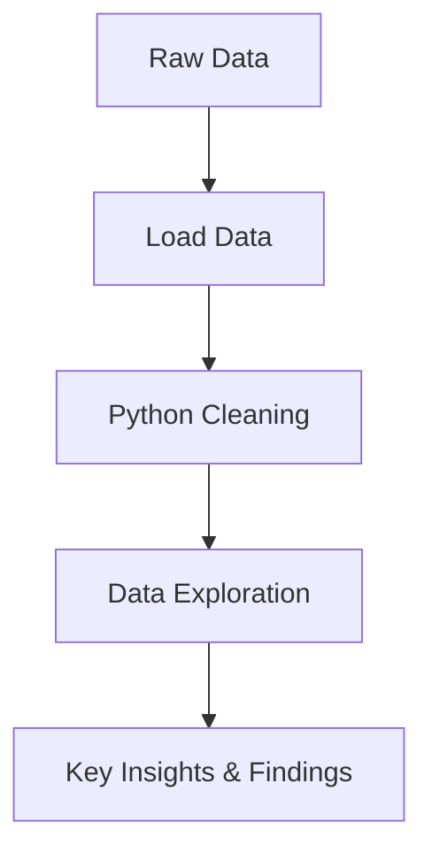

## Global Homicide Rate Analysis:

## Understanding Trends While Comparing Nigeria & Africa to the Rest of the World


**Homicide** remains a significant global issue, with stark differences across countries, subregions, and continents. Understanding the scale and pattern of homicides across the world can reveal insights into socio-political stability, public safety, and developmental challenges. However, a comparative and regional perspective especially for Africa and Nigeria is often missing in mainstream data narratives.

---

### 🎯 Project Objectve
To conduct a thorough analysis of global homicide data, with special focus on Nigeria and Africa, comparing their patterns, rates, and trends with other regions around the world.

### Expected Outcomes
- Clear visualization of global homicide distribution
- Insight into regional disparities and socio-economic implications
-  comparative lens to evaluate Nigeria and Africa's performance
-  Data-driven narrative for policy makers and researchers

--- 

## 🧰 Tools Stack

- **Python**  
  - `pandas`, `numpy` – Data Cleaning, Data manipulation  
  - `matplotlib`, `seaborn` – Data visualization
  -      
- **Jupyter Notebook** – For interactive development
- 
- **Git & GitHub** – Version control and project showcase


---

## 🧾 Data Source

The dataset is sourced from [Data World Bank](https://data.worldbank.org/indicator/VC.IHR.PSRC.P5).

#### Dataset Overview
- `location:` Country name
- `region:` Continent or macro-region
- `subregion:` Geographical subregion
- `rate:` Homicide rate per 100,000 people
- `count:` Number of homicide cases
- `year:` Year of data record
- `percentage_of_total:` Country's share of global homicide count
- **Note:** Each country’s data corresponds to the most recent available year.

---

## Data Processing Pipeline


---

## 🔍 Analysis Workflow
1. Importing all Libraries & dependenices
   - Load datasets
   - initial exploration
2. Data cleaning
3. Exploratory Data Analysis (EDA)
   - Global Summary
   - Regional & Subregional Insights
   - Nigeria & Africa Focus
   - Distribution Analysis
4. Key Findings

--- 

## Step 1
**Import all dependencies**
```python
import numpy as np
import pandas as pd
import matplotlib.pyplot as plt
import seaborn as sns
import plotly.express as px
```
**Loading Datasets & Initial Exploration**
```python
df = pd.read_csv('homicide_by_countries.csv')

#first 10 rows of dataset
df.head(10)

#last 10 rows of dataset
df.tail(10)

#shape of dataset
df.shape

#information about columns, datatypes, general DataFrame
df.info()

#Statistical Summary Of all Numerical Columns
df.describe()

# Statistical Summary Of all Columns
df.describe(include='any')
```
## Step 2
**Data Cleaning**
```python
df['count'].sum()

# Check for missing values
df.isnull().sum()

# convert column type to correct dtype

df.columns
my_list = ['Count', 'Year', 'Rate']
for i in my_list:
    df[i] = df[i].astype(int)
df.info()

# Convert column titles to all lowercase
df.columns = df.columns.str.lower()
df.columns

#Feature Engineering
df['percentage_of_total'] = (df['count'] * 100 / df['count'].sum()).round(2)
df
```

### Step 3 Exploratory Data Analysis (EDA)
**Global Summary (Regional & Subregional Insights)**
```python
# Global homicide count and average rate

global_count = df['count'].sum()
global_avg_rate = df['rate'].mean()
year_range = df['year'].min(), df['year'].max()

print(f"Total Homicide Count: {global_count:,}")
print(f"Global Average Homicide Rate: {global_avg_rate:.2f} Per 100,00 People")
print(f"Year Range: {year_range[0]} to {year_range[1]}")
```
##### Output:
- Total Homicide Count: 378,846
- Global Average Homicide Rate: 6.41 Per 100,00 People
- Year Range: 2006 to 2021

##### Top Countries By Homicide Rate (per 100k people)
```python
# Top 5 countries by highest homicide rate
top_countries = df.sort_values('rate', ascending=False).head(5)

plt.figure(figsize=(8,6))
sns.barplot(x='rate', y='location', data=top_countries, color='crimson', width=0.5)
plt.title('Countries With Highest Homicide Rate', fontsize= 16)
plt.xlabel('Homicide Rate (per 100k)', fontsize= 14)
plt.ylabel('Country', fontsize= 14)
plt.xticks(fontsize=14)
plt.yticks(fontsize=14)
plt.show()
```


##### Top Countries By Percentage Of Global Homicides & Count
```python
# Top 10 countries by percentage of global homicides

top_countries_by_percentage = df.sort_values('percentage_of_total', ascending=False).head(10)
top_countries_by_percentage
```
**Table:**


##### Top Countries By Homicides & Count
```python
# Top 5 countries by homicide count

plt.figure(figsize=(8,6))
sns.barplot(x='count', y='location', data=top_countries_by_count, color='crimson', width=0.5)
plt.title('Top 5 Countries by Homicide Count', fontsize=16)
plt.xlabel('Homicide Count', fontsize=14)
plt.ylabel('Country', fontsize=14)
plt.xticks(fontsize=14)
plt.yticks(fontsize=14)
plt.show()
```


--- 

### 🌍 Regional & Subregional Insights
**Regions with Highest Homicide Count**
```python
# Grouping Regions by homicide count

region_count = df.groupby('region').agg({
    'count': 'sum',
    'rate': 'mean',
    'percentage_of_total': 'sum'
}).sort_values('count', ascending=False)
region_count
```
**Table:**


**Visual:**


##### Homicide count comparison

```python
#Percentage Of Share by Region

region_share = region_count['percentage_of_total']
region_share

# Pie chart for homicide share by region

plt.figure(figsize=(4, 4))
region_share.plot(kind='pie', autopct='%1.1f%%', colors=sns.color_palette('Reds', len(region_share)))
plt.title('Global Homicide Share by Region')
plt.ylabel('')
plt.tight_layout()
plt.show()
```


--- 

### 🇳🇬 How Does Nigeria Compare To The Rest Of The World?

```python
#filtering rows for only Nigeria

nigeria = df[df['location'] == 'Nigeria'].iloc[0]
nigeria

# Getting global average rate and Africa average rate

africa_df = df[df['region'] == 'Africa']
africa_avg_rate = africa_df['rate'].mean()
africa_avg_count = africa_df['count'].mean()
world_avg_rate = df['rate'].mean()

# Visualize Nigeria vs Africa vs World

comparison = pd.DataFrame({
    'Group': ['Nigeria', 'Africa (avg)', 'World (avg)'],
    'Rate': [nigeria['rate'], africa_avg_rate, world_avg_rate],
    'Count': [nigeria['count'], africa_avg_count, df['count'].mean()]
})

plt.figure(figsize=(8,4))
sns.barplot(x='Group', y='Rate', data=comparison, color='crimson')
plt.title('Homicide Rate: Nigeria vs Africa & World')
plt.ylabel('Homicide Rate')
plt.tight_layout()
plt.show()
```


##### Homicide count comparison
```python
# Homicide count comparison

plt.figure(figsize=(8,4))
sns.barplot(x='Group', y='Count', data=comparison, color='crimson')
plt.title('Homicide Count: Nigeria vs Africa & World')
plt.ylabel('Homicide Count')
plt.tight_layout()
plt.show()
```


---

### 🌐 Global Comparisons
**Global Homicide Rate Distribution**
```python
# Global Homicide Rate Distribution

plt.figure(figsize=(10, 6))
sns.histplot(df['rate'], kde=True, color='crimson')
plt.title('Distribution of Homicide Rates Globally')
plt.xlabel('Homicide Rate (per 100k)')
plt.ylabel('Frequency')
plt.tight_layout()
plt.show()
```


**Homicide Rate Over Years Globally**

```python
# Plotting homicide rate over years globally

plt.figure(figsize=(10,6))
sns.lineplot(data=df.groupby('year')['rate'].mean(), color='crimson')
plt.title('Average Homicide Rate by Year (Global)')
plt.xlabel('Year')
plt.ylabel('Average Homicide Rate (per 100k)')
plt.tight_layout()
plt.show()

```


**Choropleth map showing Homicide Rate per Country**
```python
# Filter the most recent data per country (if multiple years exist)
df_map = df[['location', 'rate', 'year']].dropna()
df_map['year'] = pd.to_numeric(df_map['year'], errors='coerce')
df_map = df_map.sort_values('year', ascending=False).drop_duplicates('location')

# Creating choropleth map
fig = px.choropleth(df_map,
                    locations="location",
                    locationmode="country names",
                    color="rate",
                    hover_name="location",
                    color_continuous_scale="Reds",
                    title="Global Homicide Rate by Country (per 100k)")

fig.update_layout(geo=dict(showframe=False, showcoastlines=False))
fig.show()
```


--- 


--- 

## 🔍 Key Findings & Insights

### 🌍 Regional & Subregional Insights
- Top subregions with highest homicide counts include Latin America, Sub-Saharan Africa
- Regions like Western Europe, East Asia show very low rates (per 100k)

Regions like Western Europe, East Asia show very low rates
### 🌍 Global Perspective
- Latin America dominates the top list of countries by homicide rate and count
- Sub-Saharan Africa ranks high in count but not always in rate

### 🇳🇬 Nigeria’s Position
- Nigeria has one of the highest homicide counts in Africa
- The homicide rate is significantly higher than the global average
- Nigeria’s position in global comparison shows it among top contributors to African homicide statistics

### 🌐 Africa vs the World
- Africa's subregions show higher concentration of homicide than global average
- However, countries in Latin America still record higher individual rates
- Africa’s homicide burden is spread across multiple countries rather than concentrated in few

### 📊 Distribution Analysis
- Histogram plotted to show distribution of homicide rates globally
- Kernel Density Estimation (KDE) used to understand the shape of distribution
- Most countries have a rate below 10 per 100k, but a few have extreme outliers

### 📘 Future Recommendations
- Incorporate socio-economic indicators (GDP, unemployment, education levels) to correlate with homicide rates
- Time-series analysis for countries with longer trend records
- Geospatial visualizations using choropleth maps

---

## 📌 About Me
Hi, I'm Oluwatosin Amosu Bolaji, a Data Analyst with strong skills in Python, SQL, Power BI, and Excel. I turn raw data into actionable insights through automation, data storytelling, and visual analytics. My work is rooted in analytical thinking, strong business acumen, and technical expertise. Whether it's uncovering hidden trends, optimizing workflows, or translating data into compelling stories, I bring clarity and direction to data—helping organizations make smarter, faster decisions.

## 💡 Tools & Tech:
- **Python** (Pandas, NumPy, Matplotlib, Seaborn)
- **SQL** (MsSQL, Postgree, MySQL)
- **Microsoft Power BI**
- **Microsoft Excel**
- 🔹 **Key Skills:** Data wrangling, dashboarding, reporting, and process optimization.
-    


#### 🚀 **Always learning. Always building. Data-driven to the core.**  

### 📫 **Let’s connect!**  
- 📩 oluwabolaji60@gmail.com
- 🔗 : [LinkedIn](https://www.linkedin.com/in/oluwatosin-amosu-722b88141)
- 🌐 : [My Portfolio](https://www.datascienceportfol.io/oluwabolaji60) 
- 𝕏 : [Twitter/X](https://x.com/thee_oluwatosin?s=21&t=EqoeQVdQd038wlSUzAtQzw)
- 🔗 : [Medium](https://medium.com/@oluwabolaji60)
- 🔗 : [View my Repositories](https://github.com/Tbrown1998?tab=repositories)


